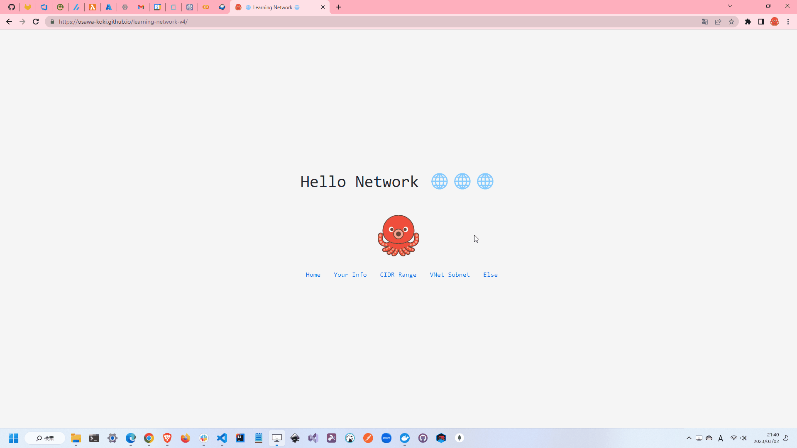

# learning-network-v4

🌐🌐🌐 ネットワークについて学ぶためのサイト。  

サブネットって何だっけ？  
サブネットマスクってどんなマスク？  
クラウド上にサーバーを立てるときに、どうやってIPアドレスを割り振るの？  
なんかVPC(VNet)を作ったら、勝手にサブネットが作られていたような気がするけど、どういうことだろう？  
サイダー？？？、シュワシュワで美味しいよね！  

っていう方に向けたサイトです。  
是非、ネットワークをマスターして、美味しくサイダーを飲みましょう！  
※ このボケはCopilot君が考えてくれたものです。  

  

## 環境構築

### 1. AWS CLIの設定

[公式サイト](https://aws.amazon.com/jp/cli/)からインストールします。  
インストール後、`aws configure`を実行し、アクセスキーとシークレットキーを入力します。  

アクセスキーとシークレットキーは、AWSのIAMページから作成します。  

`aws sts get-caller-identity`コマンドを実行して、自分のアカウントIDが表示されればOKです。  

### 2. AWS SAMの設定

[公式サイト](https://docs.aws.amazon.com/ja_jp/serverless-application-model/latest/developerguide/serverless-sam-cli-install.html)からインストールします。  
これはLambdaやAPI GatewayなどのAWSのサービスの管理ツールです。  

### 3. Lambdaのデプロイ

以下のコマンドを実行します。  
これは`./api`ディレクトリに移動して実行します。  

```shell
sam build --use-container
sam deploy --guided
```

本番環境へのデプロイは、`main`ブランチにマージすると自動で行われます。  

---

ローカルでLambdaを実行する場合は、以下のコマンドを実行します。  

```shell
sam local start-api
```

---

デプロイ後に、API GatewayのURLが表示されます。  
正しく動作しているかどうかを確認してください。  

### 4. Next.jsの設定

`.env.local.example`をコピーして、`.env.local`を作成します。  
`.env.local`には、API GatewayのURLを記述します。  

```shell
NEXT_PUBLIC_LAMBDA_API_URL=https://xxxxxxxxxx.execute-api.ap-northeast-1.amazonaws.com/Prod
```

これはGit管理対象外にしています。  
`.env.local`は、ローカルでのみ使用するためです。  

---

ローカルでNext.jsを実行する場合は、以下のコマンドを実行します。  

```shell
yarn dev
```

本番環境にデプロイするには`main`ブランチにマージします。  

### 5. シークレットの設定

GitHubのリポジトリのSettingsから、`Secrets`を作成します。  
設定内容は以下の通りです。  

| Name | Value |
| ---- | ----- |
| AWS_ACCESS_KEY_ID | AWSのアクセスキー |
| AWS_SECRET_ACCESS_KEY | AWSのシークレットキー |
| AWS_REGION | AWSのリージョン |
| SLACK_WEBHOOK_URL | SlackのWebhook URL |

## 小さな情報

### Lambdaを使用した理由

`ip-api.com`の無料枠では`HTTP`のみのアクセスが可能で、`https`のアクセスは制限されています。  
`HTTPS`で通信しているサイトから`HTTP`で通信することはできないため、Lambdaを介してアクセスするために使用しています。  

他のサービスも検討しましたが、Lambdaの学習という意味も込めて、Lambdaを使用することにしました。  
